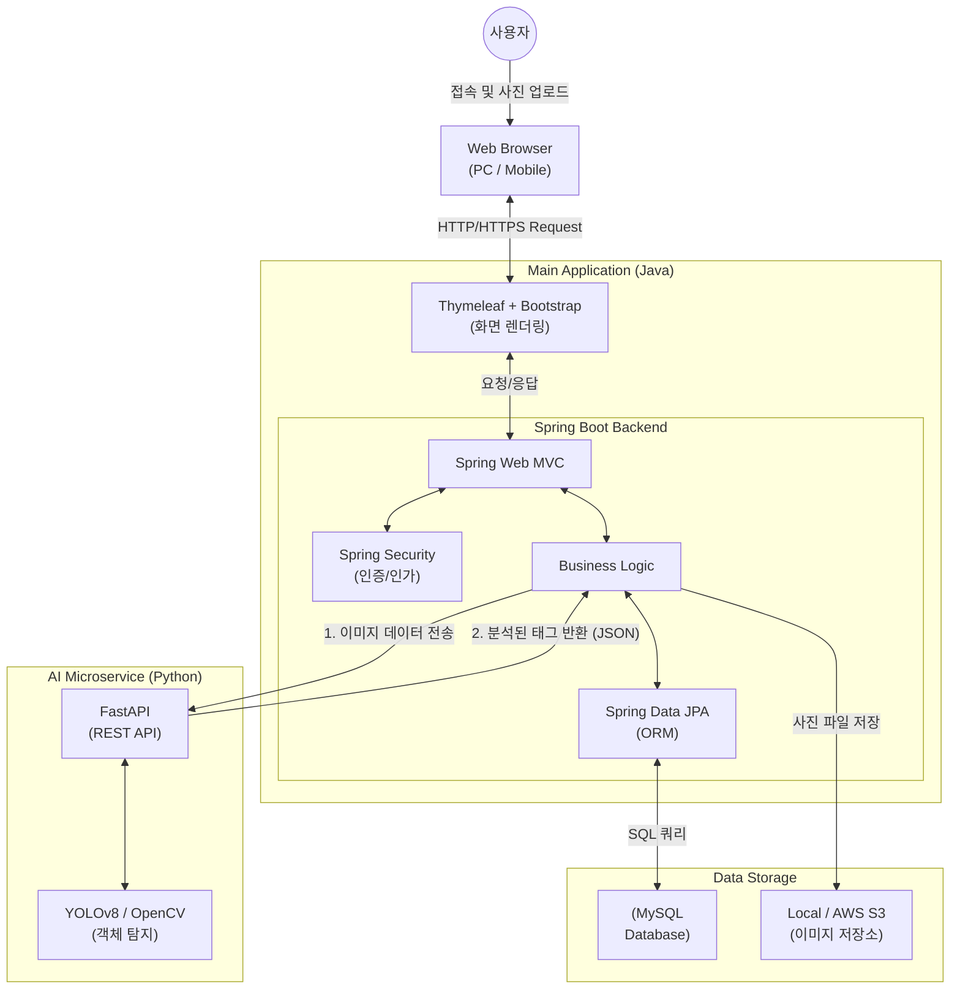

```mermaid
graph TD
    %% 사용자 및 클라이언트
    User((사용자))
    Client["Web Browser\n(PC / Mobile)"]
    
    User -->|접속 및 사진 업로드| Client
    
    %% 메인 스프링부트 서버
    subgraph "Main Application (Java)"
        direction TB
        View["Thymeleaf + Bootstrap\n(화면 렌더링)"]
        
        subgraph "Spring Boot Backend"
            Controller[Spring Web MVC]
            Security["Spring Security\n(인증/인가)"]
            Service[Business Logic]
            JPA["Spring Data JPA\n(ORM)"]
        end
        
        View <-->|요청/응답| Controller
        Controller <--> Security
        Controller <--> Service
        Service <--> JPA
    end
    
    Client <-->|"HTTP/HTTPS Request"| View
    
    %% 데이터베이스
    subgraph "Data Storage"
        DB["(MySQL\nDatabase)"]
        Storage["Local / AWS S3\n(이미지 저장소)"]
    end
    
    JPA <-->|SQL 쿼리| DB
    Service -->|사진 파일 저장| Storage
    
    %% AI 비전 서버
    subgraph "AI Microservice (Python)"
        direction TB
        API["FastAPI\n(REST API)"]
        Model["YOLOv8 / OpenCV\n(객체 탐지)"]
        
        API <--> Model
    end
    
    %% 서버 간 통신
    Service -->|1. 이미지 데이터 전송| API
    API -->|"2. 분석된 태그 반환 (JSON)"| Service
```
